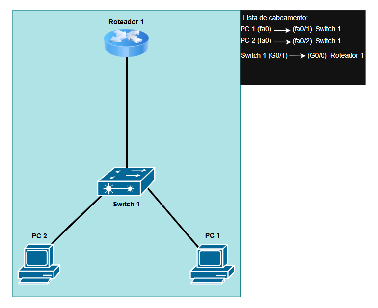

# Resolution-and-Diagnosis-of-Connectivity-between-Hosts
This is a simulated lab in the Cisco Packet Tracer simulator. In this lab, a diagnosis and resolution of a connectivity problem was performed, with visual information stored in the repository files.

PROBLEM:

Problem identified in the connectivity test (ICMP) between the department computer (CLIENTS) and the department computer (SERVERS).

 

 

As shown, these images would be the visual part of the network topology and diagram. Where it shows information about:
- Routing List between Devices
- Number of Devices

Device model and brands:
Switch 2960-24TT (CISCO)
Router 2911 (CISCO)
Generic PCs (CISCO)
