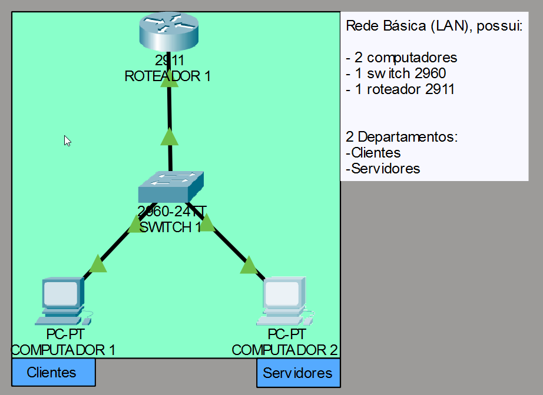
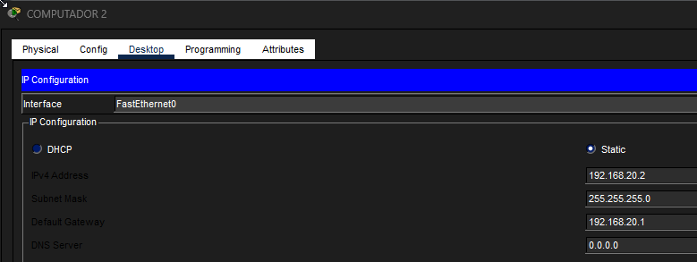
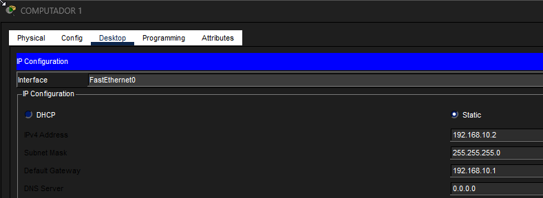
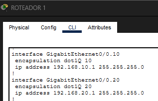
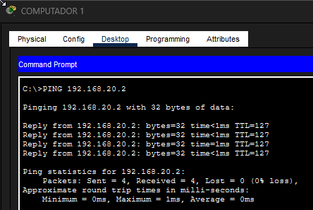
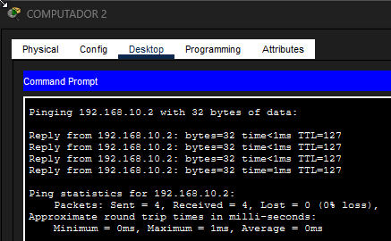

# Resolution-and-Diagnosis-of-Connectivity-between-Hosts
This is a simulated lab in the Cisco Packet Tracer simulator. In this lab, a diagnosis and resolution of a connectivity problem was performed, with visual information stored in the repository files.
\
\
\
PROBLEM:
\
 
\
Problem identified in the connectivity test (ICMP) between the department computer (CLIENTS) and the department computer (SERVERS).
\
\
\
TOPOLOGY AND DIAGRAM:
 
\
As shown, these images would be the visual part of the network topology and diagram. Where it shows information about:
- Routing List between Devices
- Number of Devices

Device model and brands:
Switch 2960-24TT (CISCO)
Router 2911 (CISCO)
Generic PCs (CISCO)
\
\
\
Where is the error and how can it be fixed?
\
What we see is an ICMP connectivity problem for a basic network that has few hosts and only one switch and router to perform routing and connectivity between hosts and departments. We can analyze some possible errors:
\
- Incorrect host subnet mask
- Incorrect IPV4 address
- Incorrect host gateway
- Incorrect access/trunk ports
- Among other specific errors
\
\
\
Check the switch and router settings:
\
 
\
As we can see:

- Trunking configured correctly
- VLANs created correctly
- Ethernet ports activated correctly
- Encapsulation of the “client” department configured correctly on the router

However, as we can see, the encapsulation of the “servers” department is not configured correctly, as the following are missing:

- Gateway and subnet mask applied


Why add them?
- The subnet mask works to define network limits, so that the host or router can identify: “is this destination on my local network or outside it?”

- The router's IP acts as a “gateway” for the network, allowing hosts to connect to the internet.

- Encapsulation works as a “traffic identifier.” When there are several departments or more than one, encapsulation is necessary to label the departments so that when traffic travels on the network, it will know where to go and which department to go to by identifying the department's TAG.
\
\
   
\
  This is also a common problem: different subnet masks on hosts. For both to have connectivity, it is necessary to set similar subnet masks.
\
\
First solution:
\
   
\
The first implementation I did was to replace the PC1 subnet. 
Before: 255.255.0.0
After: 255.255.255.0
\
\
Second Solution:
\

\
The correct subnet was implemented in the encapsulation of the ‘Servers’ department, thus labeling the department with a correct subnet for identification in network traffic.
\
\
Results of implementations:
\
\
   
\
\

```
Results:
- ICMP connectivity between hosts successfully established.
- Correct encapsulation labeling for departments.
- IPv4 + gateway + subnet mask correctly configured in a logical manner.
```

